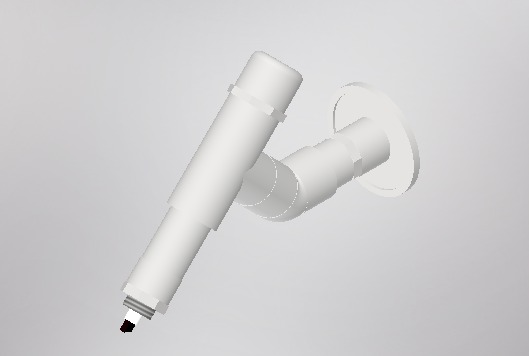

# Lab1 Escritura con robots ABB
Este repo contiene el desarrollo del primer laboratorio de robotica. El cual consiste en desarrollar una rutina de trabajo en RobotStudio  estudio de tal manera que el robot siga una trayectoria y escriba las iniciales de los integrantes del grupo.


El grupo de trabajo esta conformado por:
- Brayan Daniel Barrera Galvis
- German Andres Urbina Gutierrez
- Juan Sebastian Dueñas

Universidad Nacional de Colombia. Semestre 2023-1

## Diseño de la herramienta porta marcador
La herramienta fue fabricada a traves de tuberia PVC, Se implemento un resorte el brindaba _compliance_ a la herramienta, es decir un margen de distancia donde esta se acoplaba evitando la concentración de fuerzas excesivas que generaria una herramienta rigida. 



## Trayectoria generada
La trayectoria  se descompone en tres rutinas
- __HomeP()__: Un movimiento de los joints que lleva a la posición HOME
- __AcerInter()__: Un movimiento de los joints hace acercamiento intermedio que saca el robot de la posición de singularidad existente en el punto HOME.
- __AcerYLetras()__: Movimiento relativos lineales que componen la parte principal de la trayectoria. Este movimiento relativo se realiza respecto a un workobject denominado _tablero_ lo cual permite adaptar la ubicación de esta trayectoria cambiando los parametros de posición y orientación de este workObject.


Estas rutinas se integran en un codigo main que controla el movimiento: 

```
PROC main()
        HomeP;
        AcerInter;
        AcerYLetras;
        AcerInter;
        HomeP;
        
    ENDPROC
```

## Resultado 

Acontinuación  se presenta el video de la trayectoria generada.[youtube](https://youtu.be/m-yqHlW-zdo)

https://user-images.githubusercontent.com/25491198/224460118-cd8939d8-fd88-455e-8168-599022a2752d.mp4

<!--- hiden change 
-->
